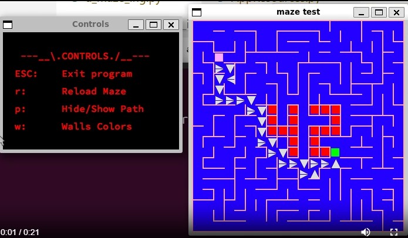

# A-Maze-ing (42 Project)



A-Maze-ing is a maze generator and solver written in Python as part of the 42 School curriculum. This project focuses on maze generation algorithms, shortest-path computation, graphical rendering with MiniLibX, and modular software design.

The subject challenges students to build a fully functional maze system capable of generating, displaying, and solving perfect and imperfect mazes.

> This project received a high score.

## Features

### Mandatory Requirements

- Standalone maze generator
- Generation of perfect and imperfect mazes
- Shortest-path computation
- Parsing of a `config.txt` file
- Creation of `output_map.txt` according to subject requirements
- Interactive controls to:
  - Change wall colors
  - Regenerate the maze
  - Show or hide the shortest path

### Enhancements

- Graphical rendering using the MiniLibX library
- Simple animations to visualize maze generation and solving
- Extended configuration options
- Background music and sound effects (with an authored theme made by @SAMONEWESTER)

## What You Can Learn From This Project

This repository can serve as a reference for students working on a 42 maze project or similar Python graphics projects.

Key learning areas include:

- Depth-First Search (DFS) for maze generation
- Graph traversal and shortest-path algorithms like Breadth-Frist Search (BFS)
- Pathfinding visualization techniques
- Using MiniLibX for window management and rendering
- Implementing animation loops and event-driven input
- Structuring a medium-sized, multi-module Python codebase

We put care in the application of **Software Engineering best practices** beyond the common norm. In addition, reviewing the commit history and [Issues section](https://github.com/evaristoc/a-maze-ing-42/issues?q=is%3Aissue%20state%3Aclosed) provides insight into **collaborative development for small teams**, iteration cycles, debugging strategies, and team-based project organization.

## Quick Start

```bash
git clone https://github.com/evaristoc/a-maze-ing-42.git
cd a-maze-ing-42/project
# follow build and run instructions inside /project README
```

## Technical Documentation

The project is inside the `project` folder. Detailed documentation is available in:

`project/README.md`

Details that you can find in the inner README file includes:

- Architecture breakdown
- Module responsibilities
- Design decisions
- Configuration structure
- Build and usage instructions

If you want to understand how the system works internally, start there.

## Purpose

This repository is intended not only as a completed school project, but as a learning benchmark for other students building algorithmic and graphical projects within the 42 environment.
