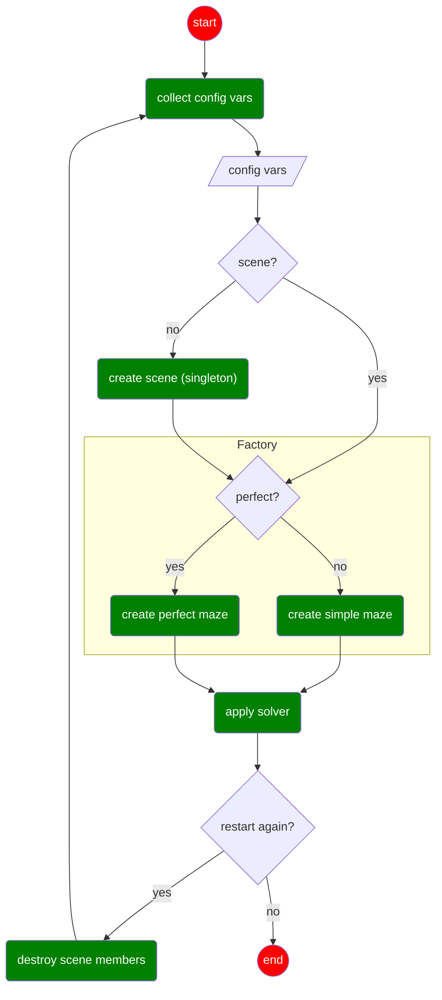

# a-maz-ing

```mermaid
flowchart TD
start((start)):::terminator
Solver(apply solver):::process
start --> Collect(collect config vars):::process
Collect --> Config[/config vars/]
Config --> Singleton{scene?}
Singleton -->|no|Scene("create scene (singleton)"):::process
Singleton -->|yes|Fac{perfect?}
Scene --> Fac
subgraph Factory
Fac --> |no|SimMaze(create simple maze):::process
Fac --> |yes|PerMaze(create perfect maze):::process
end
SimMaze --> Solver
PerMaze --> Solver
Solver --> Restart{restart again?}
Destroy --> Collect
Restart --> |yes|Destroy(destroy scene members):::process
Restart -->|no|finish((end)):::terminator
classDef terminator fill:#f00, color:#fff 
classDef process fill:green, color:#fff
```
