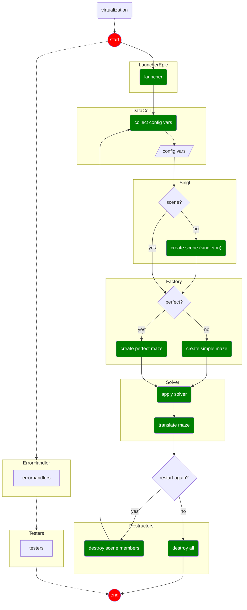

# a-maze-ing: Maze Generator & Visualizer

## Overview

This project consists of two main parts:

1. **Maze Generator Package**
   A reusable module responsible for generating maze data structures.

2. **Maze Visualization App**
   A graphical application that consumes the generator’s output, renders the maze, and enables user interaction.

The generator is independent from the rendering layer, ensuring a clear separation between maze logic and graphical presentation.

## Project Structure

```
.
|-- Makefile
|-- README.md
|-- a_maze_ing.py
|-- config.txt
|-- install_modules.sh
|-- mazegen.1.0.tr.gz # Maze Generator package - Core maze generation logic
|-- modules
|   |`.. (mazegen) # Maze Generator source code after built / installation
|    `-- minilibx
|-- pyproject.toml
`-- src  # Graphical interface and rendering
    |`-- __init__.py
    |`-- __main__.py
    |`-- collect_config_variables
    |`-- renderer
     `-- sound_effects_and_music
```

## Main Components

### mazegen package

- **mazegen** is a standalone module that generates maze data structures.
- It is independent of the visualization layer.

### a_maze_ing.py

`a_maze_ing.py` is the **true controller of the project**.

More specifically, the `render_maze` function:

- Reads configuration data from `config.txt`
- Validates and parses the configuration
- Instantiates the graphical abstractions
- Configures and wires the different components
- Registers the necessary hooks

`render_maze` runs inside a `main` function that:

- Starts the graphical loop
- Maintains execution
- Properly destroys the windows and releases resources upon termination

This file defines and controls the full lifecycle of the application.

### app renderer (`src`)

The rendering subsystem is designed as a layered abstraction built on top of the existing graphical engine wrapper.

It fulfills three primary responsibilities:

- Parsing and validating configuration data from `config.txt`
- Abstracting the graphical engine through a higher-level interface
- Maintaining event handlers tied to rendering logic

#### Graphical Abstraction

An additional abstraction layer is introduced on top of the existing wrapper to provide a project-oriented API that:

- Enables a more intuitive drawing workflow (in the spirit of canvas-style APIs)
- Simplifies animation handling
- Minimizes exposure to low-level graphical calls
- Clearly separates rendering mechanics from application logic

Core graphical primitives — **MlxContext**, **Viewport**, **Image**, and **Renderer** — are fully independent components with clearly separated responsibilities.

The `Renderer` is a project-specific orchestration unit responsible for:

- Consuming and storing rendering configuration data
- Maintaining rendering-related state
- Delegating maze element drawing to the `Image` abstraction

## Installation & Usage

### Requirements

- Python **3.11+**
- `python3-venv` package installed (required to create virtual environments)
- `make`
- Unix-like environment

### Setup

1. Clone the repository:

```bash
git clone <repository_url>
cd <cloned_repository_folder>
```

2. Ensure the installer script is executable:

```bash
chmod +x install_modules.sh
```

3. Build the project from the root of the folder:

```bash
make
```

> The installer creates a `.venv` directory inside the project folder.

4. Activate the virtual environment:

```bash
source .venv/bin/activate
```

5. Run the application:

```bash
python a_maze_ing.py config.txt
```

## Project Flowchart (draft)


