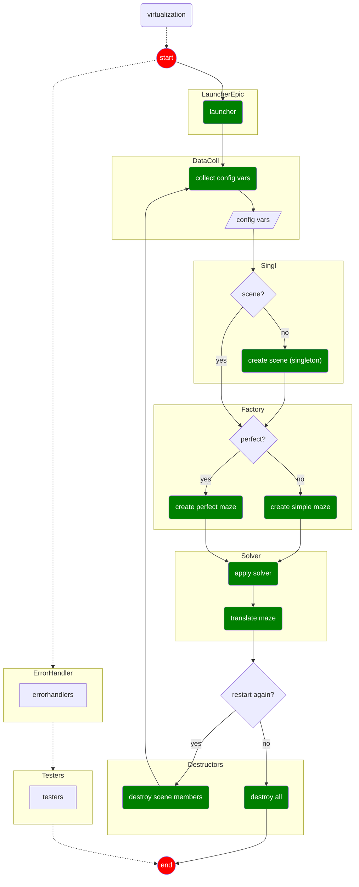

# a-maz-ing

```mermaid
flowchart TD
subgraph ErrorHandler
	errorhandlers
end
subgraph Testers
	testers
end
Virt(virtualization) -.-> start
start -.-> ErrorHandler -.-> Testers -.-> finish
start((start)):::terminator
HexTrans(translate maze):::process
ShortDist(apply solver):::process
subgraph LauncherEpic
	Launcher
end
start --> Launcher(launcher):::process
Launcher --> Collect(collect config vars):::process
subgraph DataColl
Collect --> Config[/config vars/]
end
Config --> Singleton{scene?}
subgraph Singl
Singleton -->|no|Scene("create scene (singleton)"):::process
end
subgraph Factory
Scene --> Fac
Singleton -->|yes|Fac{perfect?}
Fac --> |no|SimMaze(create simple maze):::process
Fac --> |yes|PerMaze(create perfect maze):::process
end
SimMaze --> ShortDist
PerMaze --> ShortDist
subgraph Solver
ShortDist --> HexTrans
end
HexTrans --> Restart{restart again?}
subgraph Destructors
Destroy
DestroyAll(destroy all):::process
end
Destroy --> Collect
Restart --> |yes|Destroy(destroy scene members):::process
Restart --> |no|DestroyAll
DestroyAll --> finish((end)):::terminator
classDef terminator fill:#f00, color:#fff 
classDef process fill:green, color:#fff
```
