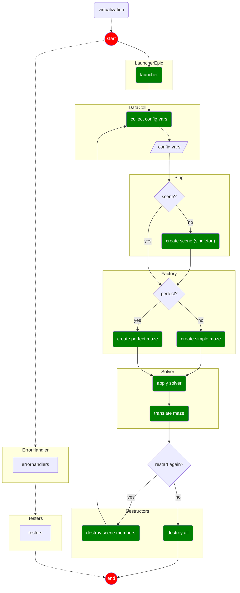

_This project has been created as part of the 42 curriculum by swester, ecarabal_

# a-maz-ing

This project not only implement the mandatory features but also other enhacements. Between the mandatory ones are:

- reading from config.txt
- capacity to create perfect and inperfect mazes and finding the shortest path
- creation of output_map.txt (maze in hex; shortest path directions; entry / exit coordinates)
- interactions to modify:
  - wall colors
  - re-generate the maze
  - show/hide shortest path
- a separate maze generator package from the renderer

As additional enhacements, the project also offers the following features:

- **full MLX rendering**, exclusively based on drawing on image buffer (no use of external images)
- **animation of the maze** at every upload / re-load
- **music and sound**, with a music theme made by one of the authors (@SAMONEWESTER)
- **broad range of configurable features**, eg. wall thickness, colors, cell size and more (see [config.txt](./config.txt))

## Development Workflow & Definition of Done (DoD)

This document describes the expected development workflow, repository structure, Git practices, and current MiniLibX setup. It is intended for contributors across teams.

---

### Repository Structure & Organization

#### Epics & Features

- Development work is organized by **Epic**.
- Each Epic must live in its own subfolder under `src/`:

  ```
  src/<epic_name>/
  ```

- Contributors should work locally and only commit code that is scoped to a single Epic per branch.

#### Shared Code

- A `utils/` folder is reserved for reusable functions or classes that may be used across Epics.
- This follows a `libft`-like philosophy: shared, generic, and well-documented utilities only.

#### Testing & Error Handling

- Two global folders are reserved:

  ```
  tests/
  error_handlers/
  ```

- Tests and error handlers may:
  - Live in subfolders named after the related Epic, **or**
  - Be clearly named to reflect the Epic or feature they belong to.

---

### Definition of Done (DoD)

A feature or Epic is **not considered complete** unless:

- ✅ Tests exist for the implemented functionality
- ✅ Error handling is implemented where applicable
- ✅ Code is isolated to its Epic folder
- ✅ The branch is rebased on top of `development`
- ✅ It passes `flake8` and `mypy`
- ✅ A Pull Request is opened and reviewed

> Projects without a testing effort will **not be accepted**.

Testing and error-handling practices may follow the same principles used in **Mod02 Python Piscine**. We will use `pytest` library combined with `unittest` library for testing.

#### Dependency Management

- Installing and using dependencies is considered part of the development workflow.
- This may be added formally to the Definition of Done.

---

### Git Workflow

#### Branching Strategy

- `development` is the main integration branch.
- Each Epic must be developed in its **own feature branch**:

  ```
  feature/<epic-name>
  ```

#### Starting Work on an Epic

1. Clone the repository fresh if no local on your computer
2. Start _always_ **from `development`**
3. If already working from a old local, go to `development` and do `git fetch`
4. Create a new branch for the Epic :

   ```bash
   git checkout -b feature/<epic-name>
   ```

5. Create the Epic folder:

   ```bash
   src/<epic-name>/
   ```

6. Copy relevant source code, tests, and error handlers into the appropriate folders
7. Commit and push the branch while you are working on it
8. Keep the branch fresh by fetching from `development` while working on it
9. `fetch` is **required** when the project is considered ready (see DoD above) for PR

#### Keeping Your Branch Up to Date

Contributors are expected to regularly sync with `development`.

Before starting new work **and before pushing a branch for review**:

```bash
git fetch origin
git rebase origin/development
```

- If conflicts occur during rebase, stop and ask for assistance.
- Do **not** merge `development` into your branch—**always rebase**.

#### Pull Requests

- Pull Requests must target the `development` branch.
- If changes are required:
  - **Do not push directly**
  - Leave comments in the PR discussion

- A PR is merged only once all parties agree it is complete and meets the DoD.

---

### MiniLibX (mlx) Development Workflow

#### Makefile Usage

- The Makefile is the **entry point for project setup and development**.
- Contributors should use the Makefile to initialize and manipulate the project.

> ⚠️ The Makefile, `setup.sh`, and related tooling may be under active development.
> Do not modify or execute them unless explicitly instructed.

#### MiniLibX Test Setup

To validate the MiniLibX setup:

1. Create a new branch:

   ```bash
   git checkout -b virtlaunch
   ```

2. Pull from the `virtlaunch` branch in the repository
3. Navigate to the project root
4. Run:

   ```bash
   make
   source .venv/bin/activate
   ```

5. Execute the test:

   ```bash
   python .venv/lib64/python3.13/site-packages/mlx/test/simple_test.py
   ```

- A more advanced test is available in the same directory.
- Changes related to MiniLibX must be discussed via PR comments.
- Do **not** push fixes directly unless agreed upon.

Once validated, this setup will become the default development baseline.

## Project Flowchart (draft)


