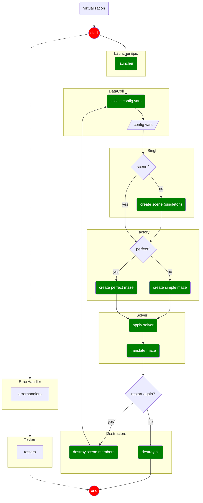

_This project has been created as part of the 42 curriculum by swester, ecarabal_

# a-maze-ing


This project not only implement the mandatory features but also other enhacements. Between the mandatory ones are:

- a separate maze generator package from the renderer
- reading from config.txt
- capacity to create perfect as well as imperfect mazes and finding the shortest path
- creation of output_map.txt (maze in hex; shortest path directions; entry / exit coordinates)
- interactions to modify:
  - wall colors
  - re-generate the maze
  - show/hide shortest path

As additional enhacements, the project also offers the following features:

- **full MLX rendering**, exclusively based on drawing on image buffer (ie. no use of external images)
- **animation of the maze** at every upload / re-load
- **music and sound**, with a theme made by one of the authors (@SAMONEWESTER)
- **broader range of configurable features**, eg. wall thickness, colors, cell size and more (see [config.txt](./config.txt))

## Overview

This project consists of two main parts:

1. **Maze Generator Package**
   A reusable module responsible for generating maze data structures.

2. **Maze Visualization App**
   A graphical application that consumes the generator’s output, renders the maze, and enables user interaction.

The generator is independent from the rendering layer, ensuring a clear separation between maze logic and graphical presentation.

## Project Structure

```
.
|-- Makefile
|-- README.md
|-- a_maze_ing.py
|-- config.txt
|-- install_modules.sh
|-- mazegen.1.0.tr.gz # Maze Generator package - Core maze generation logic
|-- modules
|   |`.. (mazegen) # Maze Generator source code after built / installation
|    `-- minilibx
|-- pyproject.toml
`-- src  # Graphical interface and rendering
    |`-- __init__.py
    |`-- __main__.py
    |`-- collect_config_variables
    |`-- renderer
     `-- sound_effects_and_music
```

## Main Components

### mazegen package

- **mazegen** is a standalone module that generates maze data structures.
- It is independent of the visualization layer.

### a_maze_ing.py

`a_maze_ing.py` is the **true controller of the project**.

More specifically, the `render_maze` function:

- Reads configuration data from `config.txt`
- Validates and parses the configuration
- Instantiates the graphical abstractions
- Configures and wires the different components
- Registers the necessary hooks

`render_maze` runs inside a `main` function that:

- Starts the graphical loop
- Maintains execution
- Properly destroys the windows and releases resources upon termination

This file defines and controls the full lifecycle of the application.

### app renderer (`src`)

The rendering subsystem is designed as a layered abstraction built on top of the existing graphical engine wrapper.

It fulfills three primary responsibilities:

- Parsing and validating configuration data from `config.txt`
- Abstracting the graphical engine through a higher-level interface
- Maintaining event handlers tied to rendering logic

#### Graphical Abstraction

An additional abstraction layer is introduced on top of the existing wrapper to provide a project-oriented API that:

- Enables a more intuitive drawing workflow (in the spirit of canvas-style APIs)
- Simplifies animation handling
- Minimizes exposure to low-level graphical calls
- Clearly separates rendering mechanics from application logic

Core graphical primitives — **MlxContext**, **Viewport**, **Image**, and **Renderer** — are fully independent components with clearly separated responsibilities.

The `Renderer` is a project-specific orchestration unit responsible for:

- Consuming and storing rendering configuration data
- Maintaining rendering-related state
- Delegating maze element drawing to the `Image` abstraction

## Installation & Usage

### Requirements

- Python **3.11+**
- `python3-venv` package installed (required to create virtual environments)
- `make`
- Unix-like environment

### Setup

1. Clone the repository:

```bash
git clone <repository_url>
cd <cloned_repository_folder>
```

2. Ensure the installer script is executable:

```bash
chmod +x install_modules.sh
```

3. Build the project from the root of the folder:

```bash
make
```

> The installer creates a `.venv` directory inside the project folder.

4. Activate the virtual environment:

```bash
source .venv/bin/activate
```

5. Run the application:

```bash
python a_maze_ing.py config.txt
```

## Project Flowchart (draft)



# MazeGenerator Instructions

A high-level `class` that coordinates maze creation, solving, and export. It wraps the `Maze`, `builder`, and `solver` logic into a simple interface.

---

## Location

```
modules/mazegen/src/mazegen/generator.py
```

---

## Usage

```python
from mazegen import MazeGenerator

gen = MazeGenerator(width=20, height=20, seed=42)

gen.generate(
    perfect=True,
    entry=(0, 0),
    exit=(19, 19)
)

structure = gen.get_structure()   # 2D cell grid
solution  = gen.get_solution()    # solved path as list of Cells
directions = gen.get_directions() # list of (Cell, direction_str) tuples

gen.save("output.map")
```

---

## Constructor

```python
MazeGenerator(width=10, height=10, seed=0)
```

| Parameter | Type  | Default | Description                               |
| --------- | ----- | ------- | ----------------------------------------- |
| `width`   | `int` | `10`    | Number of columns in the maze             |
| `height`  | `int` | `10`    | Number of rows in the maze                |
| `seed`    | `int` | `0`     | RNG seed for reproducible maze generation |

---

## Methods

### `generate(perfect, entry, exit) -> None`

Builds and solves the maze. This is the main entry point — call it before any of the getters.

| Parameter | Type    | Default  | Description                                                                                                                                                                      |
| --------- | ------- | -------- | -------------------------------------------------------------------------------------------------------------------------------------------------------------------------------- |
| `perfect` | `bool`  | `True`   | If `True`, generates a perfect maze (single solution path) using `SinglePathSolver`. If `False`, generates a simple maze and finds the shortest path using `ShortestPathSolver`. |
| `entry`   | `tuple` | `(0, 0)` | Coordinates of the maze entry cell `(col, row)`                                                                                                                                  |
| `exit`    | `tuple` | `(0, 0)` | Coordinates of the maze exit cell `(col, row)`                                                                                                                                   |

Internally this method:

1. Creates a `Maze` instance with the configured dimensions and seed
2. Places the 42 glyph at the maze center
3. Places entry and exit cells
4. Generates the maze and solves it, storing the result

---

### `get_structure() -> Any`

Returns the raw 2D cell grid (`maze.two_dimensional_cell_grid`) after generation.

---

### `get_solution() -> list`

Returns the solution path as a list of `Cell` objects from entry to exit.

---

### `get_directions() -> list[tuple[Cell, str]]`

Returns the solution as a list of `(Cell, direction)` pairs, excluding the entry and exit cells. Directions are cardinal strings (e.g. `"NORTH"`, `"SOUTH"`, `"EAST"`, `"WEST`).

---

### `save(output_file: str) -> None`

Writes the maze and its solution to a hexadecimal map file.

| Parameter     | Type  | Description             |
| ------------- | ----- | ----------------------- |
| `output_file` | `str` | Path to the output file |

---

## Solver behaviour

| `perfect` flag | Maze type                             | Solver used          |
| -------------- | ------------------------------------- | -------------------- |
| `True`         | Perfect maze (no loops, one solution) | `SinglePathSolver`   |
| `False`        | Simple maze (may have loops)          | `ShortestPathSolver` |

---

## Dependencies

| Module                 | Purpose                                   |
| ---------------------- | ----------------------------------------- |
| `mazegen.map`          | Hex file writing and direction conversion |
| `mazegen.maze_factory` | `Maze` and `Cell` types                   |
| `mazegen.maze_solvers` | `SinglePathSolver`, `ShortestPathSolver`  |

---

## Notes

- All three dimensions (`width`, `height`, `seed`) must be non-zero and non-`None` for the `Maze` to be instantiated. If any are falsy the maze object is never created and subsequent calls will raise `AttributeError`.
- `get_directions()` strips the first and last cells of the solution path (entry/exit), so the returned list covers only interior waypoints.
- The `save()` method uses the stored `entry`, `exit`, and `solution` set during the last `generate()` call.
