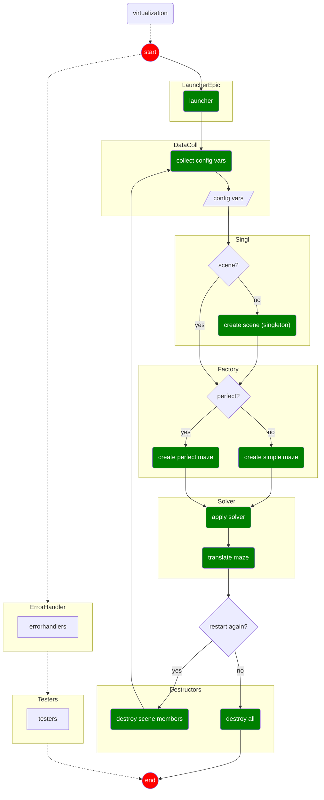

# a-maz-ing

---

Next iteration we can add:

- [ ] Architecture overview
- [ ] Rendering strategy (frame loop, dirty regions, etc.)
- [ ] Installation & build instructions
- [ ] Controls
- [ ] Design philosophy
- [ ] Performance considerations

Tell me what to expand next.

---

# Maze Generator & Visualizer

## Overview

This project consists of two main parts:

1. **Maze Generator Package**
   A reusable module responsible for generating maze data structures.

2. **Maze Visualization App**
   A graphical application that uses the generator to render mazes and
   allows user interaction with additional visual features.

The generator is independent from the rendering layer, enabling clean
separation between maze logic and graphical presentation.

---

## Project Structure

```
maze_generator/     # Core maze generation logic
app/                # Graphical interface and rendering
```

- The **generator** produces maze data.
- The **app** consumes that data and displays it visually.

---

## Goals

- Keep maze logic independent from rendering.
- Provide an interactive graphical representation.
- Allow future extension with animations and user-driven features.

## Project Flowchart (draft)


